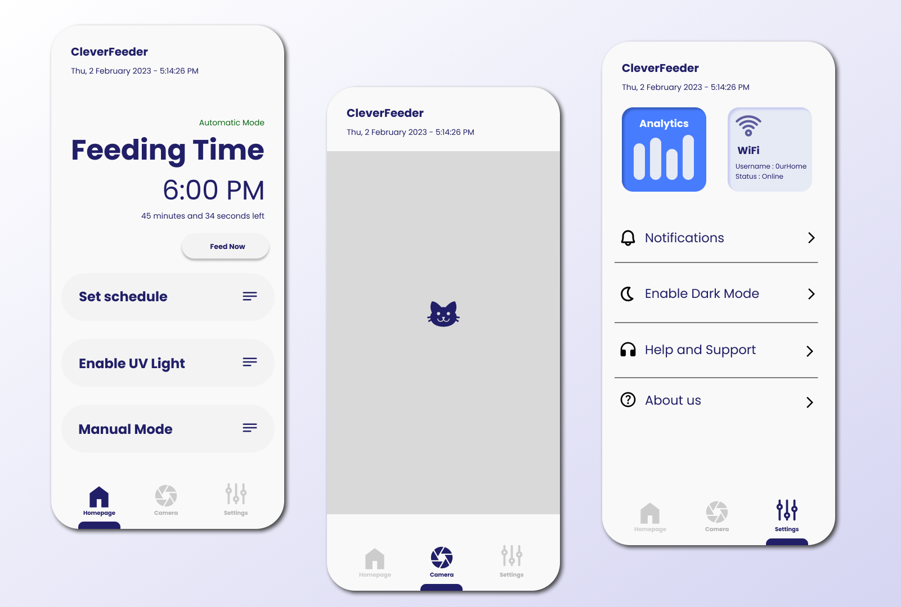

# petfeederapp

Capstone Project - Smart Pet Feeder Application

Built from *Flutter* and *MQTT*

### Tools:

* Visual Studio Code ([VSCodium](https://vscodium.com/) _better fork imo_)
* Arduino IDE ([Legacy](https://www.arduino.cc/en/software/) IDE 1.8.19)
* [MQTT CLI](https://hivemq.github.io/mqtt-cli/)

### Materials:

* Arduino UNO R3 ([View Code](https://github.com/Thanatoslayer6/ArduinoSketches/tree/main/PetFeederExperiment/Uno))
* ESP32-Cam (HW-818) with OV2640 Camera ([View Code](https://github.com/Thanatoslayer6/ArduinoSketches/tree/main/PetFeederExperiment/ESP32))
* SG90 Servo Motor
* Small/Mini Breadboard
* 5V Single-Channel Relay Module
* UV-C Light Tube (around 3-6 inches)

*to be continued...*

### Progress/Features

* [ ] Dark/Light theme
* [X] Manual Feeding (On button click)
* [ ] Automated Feeding (Based on schedule)
* [ ] UV-Light (Enable/Disable)
* [X] Camera Stream
* [ ] Speaker
* [ ] History Log (Feeding logs)
